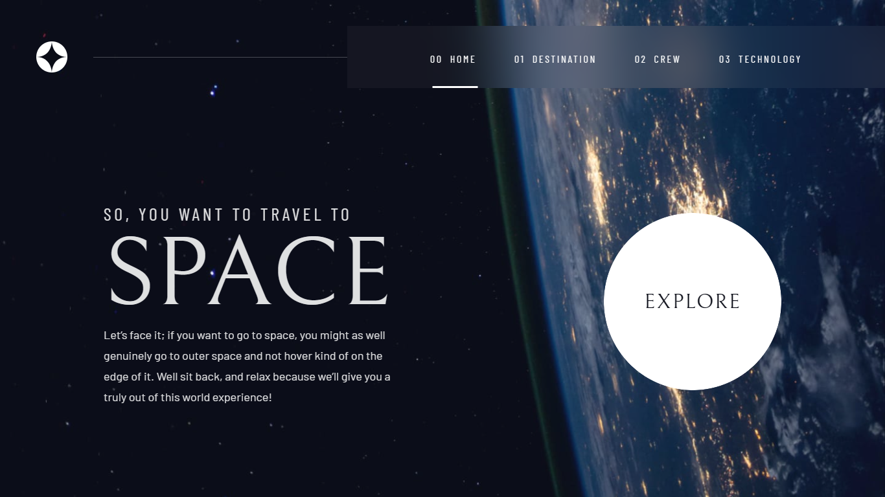

# Frontend Mentor - Space tourism website solution

## About

This is Space Tourism Website takes you on a fun experience across the solar system, kinda. I used the react router dom for the first time (actually only learned of it while building this)

## Technologies used

React and Tailwind

### Screenshot

### Links

- Live Site URL: [https://fengboris-spacetour.netlify.app](https://fengboris-spacetour.netlify.app)

### Built with
 
- Vite
- Mobile-first workflow
